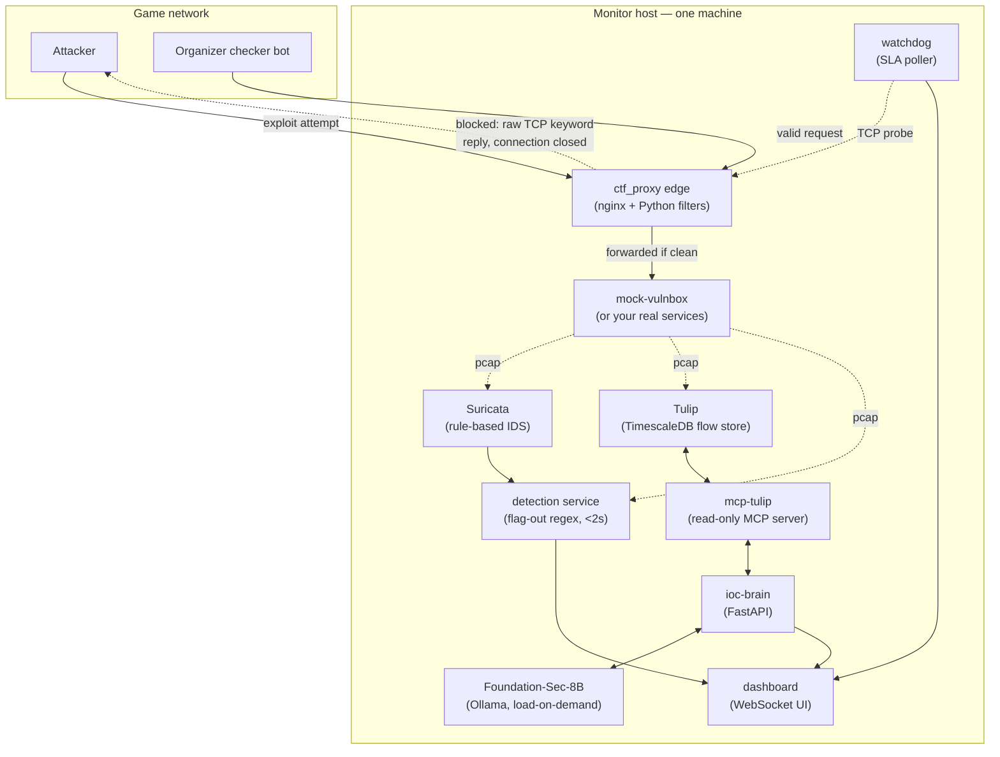

<div align="center">

# 🛡️ CTF Monitor Hub

**Single-machine situational-awareness stack for Attack-Defense CTF competitions.**

Edge mitigation, deterministic flag-exfiltration detection, LLM-assisted IOC analysis,
and SLA watchdogs — all driven from one config file.

[](https://www.python.org/)
[](https://docs.docker.com/compose/)
[](https://huggingface.co/fdtn-ai/Foundation-Sec-8B)

[⚡ Quick Radar (Live Defense UI)](quick-radar/README.md) · [Architecture](docs/ARCHITECTURE.md) · [Runbook](docs/RUNBOOK.md) · [Config schema](docs/SCHEMA.md) · [Verified status](docs/STATUS.md) · [Demo script](docs/DEMO.md) · [Run the LLM on a separate machine](docs/REMOTE_LLM.md) · [Go live on competition day](docs/GOLIVE.md)

</div>

---

## What this is

In an A/D CTF, every team runs the same vulnerable services on a "vulnbox." Other teams
attack it to steal flags; an organizer checker bot continuously verifies your services are
still up. This repo is the monitoring/defense half of that loop, built to run entirely on
one machine:

- **Block** known attack patterns at the edge before they reach your service.
- **Know immediately** when a flag leaves your network outbound.
- **Ask an LLM** what technique an attacker used, grounded in the real captured flow.
- **Get paged** the moment a service — or the edge proxy itself — goes down.

It's a monitoring hub, not a CTF platform: it doesn't run your vulnerable services for you
(a toy `mock-vulnbox` is included only so the whole pipeline can be exercised on a laptop
before competition day).

## Architecture



Three layers:

1. **Edge mitigation** — [`ctf_proxy`](https://github.com/ByteLeMani/ctf_proxy) (a real
   upstream project, not reinvented) sits in front of your services. Python filter modules
   decide per-request whether to drop traffic; a blocked connection gets a raw
   `KEYWORD SERVICE ATTACK_NAME` reply so it's instantly greppable in a pcap — there's no
   HTTP status line, so don't expect a `403` from `curl`.
2. **Detection & forensics** — [Tulip](https://github.com/OpenAttackDefenseTools/tulip)
   assembles flows into TimescaleDB/Postgres; Suricata does signature-based IDS; a small
   `detection` service regex-scans for your flag format and ingests Suricata alerts, both
   landing on the dashboard in under a second.
3. **Analysis** — an LLM ([Foundation-Sec-8B](https://huggingface.co/fdtn-ai/Foundation-Sec-8B),
   Cisco's security-tuned Llama-3.1-8B) reads real flow data through `mcp-tulip`, an MCP
   server whose Postgres role is `GRANT SELECT`-only — a write attempt is rejected by the
   database itself, not by convention.

## Quick start

```bash
git clone <this-repo>
cd Setup_tool

# Edit vulnbox IP, flag regex, service ports, ctf_proxy keyword, etc.
nano services.json
bash validate-config.sh

# Pull images/models once (needs internet; ~20-40 min)
bash pull-and-save.sh

# Bring everything up — generates every tool's config from services.json first
bash bringup.sh
```

Open the dashboard at `http://localhost:8080`. Full walkthrough, troubleshooting, and the
air-gapped restore path are in [`docs/RUNBOOK.md`](docs/RUNBOOK.md).

**Verify the edge-mitigation loop works** (legit traffic passes, an attack gets blocked, SLA
stays green):

```bash
cd offline-bundle/repos/ctf_proxy && python3 harness.py
```

## One config, every tool

`services.json` is the single source of truth. `generators/*.py` turn it into each tool's
native config (`.env` for Tulip, `config.json` for `ctf_proxy`, ...) — `bringup.sh` always
regenerates before starting anything, so a one-line config change (a port, the vulnbox IP,
the `ctf_proxy` keyword) propagates everywhere with no manual edits. `validate-config.sh`
checks required fields and that `ctf_proxy`'s generated keyword hasn't drifted from
`services.json`'s. Full field reference: [`docs/SCHEMA.md`](docs/SCHEMA.md).

## What's actually verified

Every claim in this README has been run and checked on real traffic, not just coded — see
[`docs/STATUS.md`](docs/STATUS.md) for the evidence log (commands, output, root causes of the
bugs found along the way) and what's still a known rough edge.

## Repo layout

| Path | What it is |
|---|---|
| `services.json` | Single source of truth — edit this |
| `generators/` | `services.json` → each tool's native config |
| `detection/` | Flag-out regex scanner, honeytoken collector, Suricata alert ingester |
| `mcp-tulip/` | MCP server — read-only Postgres access to Tulip's flow DB |
| `ioc-brain/` | LLM-backed IOC analysis API |
| `ml-fingerprint/` | Unsupervised (DBSCAN) bot-vs-attacker traffic fingerprinting |
| `watchdog/` | SLA health-check poller |
| `dashboard/` | Real-time alert UI |
| `mock-vulnbox/` | Toy vulnerable services for single-machine testing |
| `vulnbox-deploy/` | Scripts to deploy capture/watchdog/honeytoken onto a *real* vulnbox |
| `docs/` | Architecture, runbook, config schema, verified status, demo script |

`offline-bundle/` (cloned upstream repos, Docker images, model blobs) is a build artifact,
not source — it's gitignored; regenerate it with `pull-and-save.sh`.

## Credits

Built on top of, not instead of:
[Tulip](https://github.com/OpenAttackDefenseTools/tulip) ·
[ctf_proxy](https://github.com/ByteLeMani/ctf_proxy) ·
[pcap-broker](https://github.com/fox-it/pcap-broker) ·
[Foundation-Sec-8B](https://huggingface.co/fdtn-ai/Foundation-Sec-8B) by Cisco Foundation AI ·
[Suricata](https://suricata.io/)
