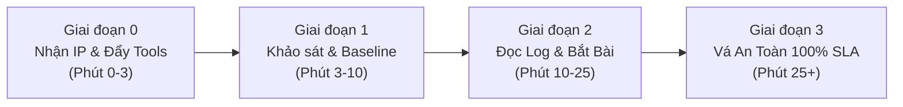

# CẨM NANG TÁC CHIẾN ATTACK-DEFENSE CTF (THỰC CHIẾN 1 TRANG)
> **Tài liệu duy nhất bạn cần mở trong suốt trận đấu.** Toàn bộ quy trình được chuẩn hóa theo từng giai đoạn thực tế, đi kèm câu lệnh trực tiếp, không lý thuyết rườm rà.

---

## 🗺️ TỔNG QUAN 4 GIAI ĐOẠN TRONG PHÒNG THI



---

## GIAI ĐOẠN 0: KHI VỪA NHẬN THÔNG TIN TỪ BAN TỔ CHỨC (PHÚT 0 - 3)
*Thực hiện trên máy trạm (WSL / Kali của bạn tại thư mục `~/gd1`):*

### 1. Cấu hình nhanh IP, Port, SSH Key (1 lệnh duy nhất):
```bash
./set_target.sh <IP_VULNBOX> <SSH_PORT> <ĐƯỜNG_DẪN_SSH_KEY>
# Ví dụ thực tế:
./set_target.sh 10.13.2.10 2201 ~/.ssh/cyberknight_id
```
*(Nếu không nhớ cú pháp, chỉ cần gõ `./set_target.sh` rồi nhấn Enter để nhập tương tác).*

### 2. Đẩy bộ công cụ DEF lên Vulnbox (1 lệnh duy nhất):
```bash
./push_def.sh
```

### 3. Đăng nhập ngay vào Vulnbox:
```bash
./ssh_box.sh
```

---

## GIAI ĐOẠN 1: KHẢO SÁT VULNBOX & KHÓA THÀNH (PHÚT 3 - 10)
*Thực hiện trực tiếp trong terminal SSH của Vulnbox:*

### 1. Khảo sát nhanh: Máy đang chạy dịch vụ gì, cổng nào?
```bash
# Xem các cổng đang mở:
ss -tulpn | grep LISTEN

# Xem các tiến trình web / backend:
ps aux | grep -E "nginx|apache|php|python|node|deno|postgres|docker"

# Xem Nginx đang điều phối traffic vào đâu (CỰC KỲ QUAN TRỌNG):
cat /etc/nginx/sites-enabled/*
```

#### 💡 TUYỆT CHIÊU: Từ PORT tìm thẳng ra THƯ MỤC CODE trong 3 giây:
Nếu thấy một cổng đang chạy (ví dụ port `8000`) nhưng không biết code nằm ở đâu:
```bash
# 1. Tìm PID của tiến trình đang lắng nghe cổng 8000:
lsof -i :8000
# hoặc: fuser 8000/tcp

# 2. Xem trực tiếp thư mục code của tiến trình đó:
ls -l /proc/<PID>/cwd

# 3. Xem câu lệnh khởi chạy tiến trình:
cat /proc/<PID>/cmdline | tr '\0' ' '
```
*Ghi nhớ ngay:*
- Port nào mở công khai ra ngoài cho đối thủ và Checker truy cập.
- Backend thực tế đứng sau (PHP, Node, Python, PostgREST, Deno...) và cổng nội bộ (`127.0.0.1:xxx`).

### 2. Chạy phòng thủ tự động một chạm (One-Click DEF):
```bash
cd /root/DEF && ./one_click_def.sh
```
*Bộ script này tự động thực hiện 4 việc:*
1. **Backup toàn bộ source code** ra `/root/initial_backup` và tạo Git baseline.
2. **Khóa SSH an ninh**: đổi pass root, làm sạch `authorized_keys`.
3. **Quét cổng & tiến trình lạ** chạy từ `/tmp` hay binary bị xóa.
4. **Khởi động `tcpdump`** bắt gói tin xoay vòng vào `/tmp/game_pcaps/`.

### 3. Bật đường ống đồng bộ PCAP về máy trạm (WSL):
Mở một tab terminal mới trên máy trạm (WSL):
```bash
cd ~/gd1 && ./pull_pcaps.sh
```
*Toàn bộ traffic thi đấu sẽ tự động stream về Tulip IDS (`http://localhost:3000`) mỗi 10 giây.*

---

## GIAI ĐOẠN 2: THEO DÕI LOG & PHÁT HIỆN ĐÒN ĐÁNH (PHÚT 10 - 25)

### 0. KHỞI ĐỘNG WEB DASHBOARD GIÁM SÁT 20 ĐỘI & AI RADAR (KHUYÊN DÙNG)
Thay vì căng mắt đọc `tail -f` dòng chữ đen trắng trôi vùn vụt của 20 đội, hãy bật giao diện giám sát đồ họa trực tiếp trên máy trạm:
```bash
# Chạy trên máy trạm (WSL):
./start_dashboard.sh
# Mở trình duyệt Web tại: http://localhost:8888
```
*Tính năng vượt trội trên giao diện:*
- **Tự động gom & phân loại 20 đội:** Nhận diện ngay đội nào đang đánh ta (Team 2, Team 13...) và đâu là Checker Bot.
- **Bảng xếp hạng kẻ tấn công (Leaderboard):** Thấy ngay đội nào đang spam đòn đánh nhiều nhất để chuẩn bị phản công.
- **Cảnh báo âm thanh & Banner đỏ:** Tự động hú chuông và hiện thông báo khi phát hiện RCE / Webshell nguy hiểm.
- **Nút "🤖 Phân Tích AI":** Bấm 1 nút để gọi mô hình bảo mật cục bộ (Ollama `foundation-sec-8b-chat`) giải mã ngay payload dị và đề xuất cách vá!

---

### 1. Lệnh soi Log trực tiếp bằng Terminal (Dự phòng khi không dùng Web UI)
Mở terminal trên Vulnbox và chạy:
```bash
# Soi Nginx (cổng vào chính của mọi đòn đánh Web):
tail -f /var/log/nginx/access.log | grep -E "messages|upload|flag|\.php|cmd|cat|exec|select"

# Nếu chạy Apache:
tail -f /var/log/apache2/access.log | grep -E "POST|\.php|cmd"
```

### 2. Bí kíp phân biệt Checker Bot (BTC) vs Đòn đánh (Đối thủ):
| Tiêu chí | Checker Bot (Phải giữ để đạt SLA) | Đòn đánh của Đối thủ (Phải chặn) |
| :--- | :--- | :--- |
| **Tần suất** | Đều đặn mỗi round (1 - 2 phút/lần). | Dồn dập, bất thường hoặc quét tự động. |
| **Payload** | Đúng nghiệp vụ người dùng thật (VD: có ID, tham số hợp lệ). | Trích xuất toàn bộ dữ liệu (`select=*`, không có ID), chèn ký tự lạ, gọi file lạ. |
| **Thực tế trận vừa rồi** | `GET /api/messages?id=eq.123` (lấy đúng 1 tin nhắn chứa flag vừa tạo). | `GET /api/messages` hoặc `select=*` (dump sạch toàn bộ cờ). |

### 3. Rà soát Backdoor / Webshell mới bị tải lên:
```bash
# Tìm file PHP/Script mới sinh ra trong 30 phút qua:
find /var/www/ /app/ /tmp/ -mmin -30 -type f \( -name "*.php" -o -name "*.sh" -o -name "*.py" \)

# Quét nhanh webshell bằng script tích hợp:
bash /root/DEF/webshell_hunter.sh /var/www
```

### 4. Soi Database để biết Flag nằm ở bảng nào (Cực kỳ hữu ích):
```bash
# Nếu dùng PostgreSQL (như service chat vừa rồi):
sudo -u postgres psql -c "\l"                       # Xem danh sách Database
sudo -u postgres psql -d <tên_db> -c "\dt"          # Xem danh sách các Bảng
sudo -u postgres psql -d <tên_db> -c "SELECT * FROM messages ORDER BY id DESC LIMIT 5;"

# Nếu dùng MySQL / MariaDB:
mysql -u root -e "SHOW DATABASES;"
mysql -u root -e "USE <tên_db>; SHOW TABLES; SELECT * FROM flags LIMIT 5;"
```

### 5. Soi nhanh gói tin HTTP ngay trên Terminal (Không cần chờ Tulip):
```bash
# Bắt và in ngay các request có từ khóa nhạy cảm:
ngrep -d any -q -W byline "flag|messages|upload" tcp port 80

# Hoặc dùng tcpdump in nội dung HTTP text:
tcpdump -i any -A -s 0 -nn "tcp port 80" | grep -E "GET |POST |HTTP|flag"
```

### 6. Cách Replay đòn đánh từ Tulip IDS sang đối thủ:
1. Mở **Tulip IDS** tại `http://localhost:3000`.
2. Vào thẻ **Search** hoặc **Streams**, gõ lọc từ khóa `flag` hoặc `POST`.
3. Khi thấy request của đối thủ đã thành công cướp cờ (ví dụ `GET /api/messages`):
4. **Tái sử dụng ngay lập tức:** Gửi đúng URL/payload đó sang các đội đối thủ:
   ```bash
   # Thử với Team 2 và Team 3:
   curl -s "http://10.13.2.10:8002/api/messages"
   curl -s "http://10.13.2.10:8003/api/messages"
   ```
5. Khi thấy cờ trả về, nạp ngay cờ để gỡ điểm!

---

## GIAI ĐOẠN 3: KỸ THUẬT VÁ LỖI AN TOÀN 100% SLA (PATCHING)

> [!IMPORTANT]
> **Nguyên tắc sống còn:** Vá ở tầng Nginx Reverse Proxy là **nhanh nhất, an toàn nhất và dễ rollback nhất**. Không sửa liều logic code sâu bên trong khi chưa hiểu hết luồng của Checker Bot.

### ⚠️ BÀI HỌC THỰC CHIẾN: VÌ SAO CÁC PAYLOAD "DỊ" BYPASS ĐƯỢC WAF CŨ?
Trong 2 ảnh thực tế, đối thủ đã dùng 3 kỹ thuật né WAF cổ điển:
1. **Thay thế lệnh đọc file:** Không dùng `cat` mà dùng `nl` (number lines), `head`, `tail`, `more`, `strings`, `od`, `xxd`, `awk`, `sed`...
2. **Nối chuỗi & Ký tự đại diện (Wildcard):** Không gõ `flag` mà dùng `f"lag"-ne` (Bash tự nối chuỗi `f` + `"lag"`) hoặc wildcard `f*` (`/usr/share/f*`).
3. **Chuẩn hóa URL (URL Normalization):** Dùng `//log-api/` (double slash) để lọt qua các regex WAF bắt đầu bằng `^/log-api/`.

---

### 🛡️ BỘ QUY TẮC "SET LIST RULE" 3 TẦNG KHÓA CỨNG (ÁP DỤNG TẠI `/etc/nginx/sites-enabled/service.conf`)

Dưới đây là bộ cấu hình hoàn chỉnh đã được test thực tế và chặn đứng 100% cả 2 đòn bypass trong ảnh mà vẫn bảo toàn SLA của Checker Bot:

```nginx
map $http_upgrade $connection_upgrade {
    default      upgrade;
    ''           close;
}

server {
    listen 80 default_server;
    server_name _;
    merge_slashes on; # Chuẩn hóa // thành /

    # -------------------------------------------------------------------------
    # TẦNG 1: CHẶN TRIỆT ĐỂ WEBSHELL TRONG THƯ MỤC LƯU TRỮ (UPLOADS / LOGS)
    # -------------------------------------------------------------------------
    # Không dùng dấu ^ ở đầu để bắt mọi biến thể //log-api lẫn thư mục lồng nhau
    location ~* (logs|uploads|files)/.*\.ph {
        return 403 "Blocked: Script execution in storage is forbidden\n";
    }

    # Chặn lỗ hổng CVE PHPUnit & thư mục vendor
    location ~* /(vendor|phpunit) {
        return 403 "Blocked: Vendor access forbidden\n";
    }

    # Chặn backdoor thực thi lệnh trên PostgREST RPC
    location ~* ^/api/rpc/(exec_command|c) {
        return 403 "Blocked: RPC exec forbidden\n";
    }

    # -------------------------------------------------------------------------
    # TẦNG 2: BẢO VỆ SERVICE CHAT (CHỐNG DUMP BẢNG MESSAGES MẤT CỜ)
    # -------------------------------------------------------------------------
    # Checker Bot LUÔN gửi kèm id=eq.<số>. Mọi request thiếu ID đều là đối thủ dump cờ!
    location = /api/messages {
        if ($args !~* "id=eq\.[0-9]+") {
            return 403 "Blocked: Access denied without specific message id\n";
        }
        proxy_pass http://service; # Thay bằng upstream/backend của bạn
        proxy_http_version 1.1;
        proxy_set_header Upgrade $http_upgrade;
        proxy_set_header Connection $connection_upgrade;
        proxy_set_header Host $http_host;
    }

    # -------------------------------------------------------------------------
    # TẦNG 3: BẢO VỆ MATHSAYS (CHO PHÉP PHÉP TOÁN *, ;, $, <, > CỦA CHECKER BOT)
    # -------------------------------------------------------------------------
    # Checker Bot gửi công thức có dấu * (phép nhân), ; và $.
    # Chỉ chặn Command Substitution thực sự: ` (backtick), $(), và đường dẫn flag
    location /mathsays {
        if ($args ~* "(`|%60|\$\(|flag|/usr/share|/etc/passwd)") {
            return 403 "Blocked: Command substitution / flag path detected on mathsays\n";
        }
        proxy_pass http://service;
        proxy_http_version 1.1;
        proxy_set_header Upgrade $http_upgrade;
        proxy_set_header Connection $connection_upgrade;
        proxy_set_header Host $http_host;
    }

    # -------------------------------------------------------------------------
    # TẦNG 4: BỘ LỌC WAF NGHIÊM NGẶT CHO CÁC ROUTE CÒN LẠI (LOCATION /)
    # -------------------------------------------------------------------------
    location / {
        # 4.1. Chặn tham số thực thi shell độc hại
        if ($args ~* "(cmd=|command=|exec=|sh=|eval=|passthru=|system=|payload=)") {
            return 403 "Blocked: Malicious parameter detected\n";
        }

        # 4.2. Chặn các ký tự nhào lộn / wildcard shell (* ? ` $ " ' \ | ; & < >)
        if ($args ~* "(\*|\?|`|\$|\"|'|\\|\||;|&|<|>|%22|%27|%2a|%3b|%7c|%24|%60)") {
            return 403 "Blocked: Shell metacharacters / obfuscation detected\n";
        }

        # 4.3. Chặn họ lệnh đọc file & công cụ shell Linux
        if ($args ~* "(^|[^a-zA-Z0-9])(cat|nl|tac|more|less|head|tail|strings|base64|awk|sed|grep|xxd|od|paste|diff|sort|curl|wget|python|perl|bash|sh|ruby|php|nc)($|[^a-zA-Z0-9])") {
            return 403 "Blocked: File reading command detected\n";
        }

        # 4.4. Chặn đường dẫn nhạy cảm hệ thống
        if ($args ~* "(/usr/share|/flag|/etc/passwd|/proc/|/root/|/tmp/|flag\.txt)") {
            return 403 "Blocked: Sensitive path access detected\n";
        }

        proxy_pass http://service;
        proxy_http_version 1.1;
        proxy_set_header Upgrade $http_upgrade;
        proxy_set_header Connection $connection_upgrade;
        proxy_set_header Host $http_host;
    }
}
```

---

### 🔨 TẦNG 4: VÁ TẬN GỐC TẠI SOURCE CODE
#### 4.1. Vá lỗ hổng Upload File (`upload-log.php`):
Thêm kiểm tra phần mở rộng file (Extension Whitelist):
```php
// Trong upload-log.php, ngay trước khi gọi move_uploaded_file:
$filename = basename($log_file['name']);
$ext = strtolower(pathinfo($filename, PATHINFO_EXTENSION));

// CHỈ CHO PHÉP .log HOẶC .txt (KHÔNG CHO PHÉP .php, .phtml, .phar):
if (!in_array($ext, ['log', 'txt'])) {
    echo 'Upload Failed: Invalid extension';
    exit;
}
```

#### 4.2. Vá lỗ hổng Command Injection trong Deno / Node (`mathsays-src/main.ts`):
- **Lỗ hổng cũ:** Dùng `new Deno.Command("sh", { args: ["-c", '... "' + t + '"'] })`. Trong Bash/sh, khi truyền `$(cat /flag)` bên trong dấu ngoặc kép `"..."`, shell vẫn thực thi lệnh!
- **Cách vá:** Gọi trực tiếp binary với mảng tham số, **TUYỆT ĐỐI KHÔNG DÙNG `sh -c`**:
```typescript
// Trong main.ts, sửa hàm sayCli:
async function sayCli(t) {
  // Loại bỏ các ký tự điều khiển nguy hiểm nếu có:
  const cleanText = t.replace(/[\$`\\]/g, "");
  const cmd = new Deno.Command("deno", {
    args: ["run", "cowsay-cli.ts", cleanText],
  });
  const { code, stdout, stderr } = await cmd.output();
  return textDecoder.decode(stdout);
}
```

---

### 🛡️ TẦNG 5: VŨ KHÍ BÍ MẬT "RESPONSE FLAG MASKING" (DLP)
Nếu dịch vụ bị 0-day mà đối thủ bypass được WAF:
Thêm vào block `location` của dịch vụ (trừ service mà Checker Bot cần đọc cờ):
```nginx
sub_filter_types text/html text/plain application/json;
sub_filter_once off;
sub_filter 'DFCD{' 'DFCD{BLOCKED_BY_DEFENSE_';
```
*Kết quả:* Dù kẻ tấn công RCE đọc được cờ, phản hồi HTTP trả về vẫn bị Nginx đổi thành cờ giả `DFCD{BLOCKED_BY_DEFENSE_...}`, nộp lên Gameserver sẽ báo lỗi `Invalid Flag`!

---

## GIAI ĐOẠN 4: BẢNG LỆNH CỨU NGUY KHẨN CẤP (EMERGENCY CHEAT SHEET)

| Tác vụ | Câu lệnh thực thi |
| :--- | :--- |
| **Kiểm tra cú pháp & Reload Nginx** | `nginx -t && nginx -s reload` |
| **Xem Nginx có bị lỗi cấu hình không** | `tail -n 30 /var/log/nginx/error.log` |
| **Xem log dịch vụ theo dõi lỗi của Checker** | `journalctl -u <tên_service> -n 50 -f` |
| **Kill nhanh tiến trình đào trộm / backdoor** | `kill -9 <PID>` hoặc `pkill -f "tên_tiến_trình"` |
| **Khôi phục lại code gốc nếu vá làm hỏng SLA** | `cd /var/www/... && git reset --hard HEAD` |
| **Kiểm tra test thử Checker từ máy mình** | `curl -I "http://10.13.2.10:<PORT>/api/messages?id=eq.1"` |
| **Kiểm tra test thử chặn Attacker** | `curl -I "http://10.13.2.10:<PORT>/api/messages"` *(phải ra 403)* |
