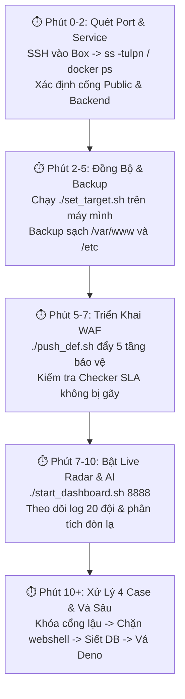

# 🛡️ SỔ TAY TÁC CHIẾN CTF ATTACK-DEFENSE (CHÍNH THỨC)

> **Mục tiêu tối thượng**: Bảo toàn 100% SLA Checker bot (không bị trừ điểm), chặn đứng 20 đội đối thủ khai thác tự động, và cung cấp thông tin cho đội Tấn công (ATK).

---

## ⚡ QUY TRÌNH TÁC CHIẾN TUẦN TỰ 5 BƯỚC (CHUẨN NHẤT)



---

### BƯỚC 1: QUÉT PORT & NHẬN DIỆN DỊCH VỤ (PHÚT 0 - 2)

> [!IMPORTANT]
> **Đề thi không bao giờ cho trước danh sách port đầy đủ**. Ngay khi nhận IP và SSH từ Ban Tổ Chức (BTC), mở terminal SSH vào Vulnbox ngay lập tức để kiểm tra.

1. **SSH vào Vulnbox**:
   ```bash
   ssh -p <SSH_PORT> root@<VULNBOX_IP>
   ```

2. **Chạy 1 lệnh duy nhất để quét mọi cổng đang LISTEN**:
   ```bash
   ss -tulpn
   # (Nếu máy không có ss thì dùng: netstat -tulpn)
   ```
   **Cách đọc kết quả bảng cổng:**
   - `0.0.0.0:22`: Cổng SSH (hệ thống, bỏ qua).
   - `0.0.0.0:80`: Cổng Web Nginx (Public chính).
   - `0.0.0.0:xxxx` hoặc `:::xxxx`: **Đây là các cổng Public của đề thi** mà mạng ngoài có thể kết nối vào!
   - `127.0.0.1:yyyy`: Cổng nội bộ (Backend giấu sau Nginx, ví dụ: 8080, 3000, 8000).

3. **Kiểm tra Docker (nếu đề thi chạy Container)**:
   ```bash
   docker ps
   ```
   *Nhìn vào cột `PORTS`: Ví dụ `0.0.0.0:8001->80/tcp`, `0.0.0.0:8002->5000/tcp` ➡️ Các cổng thi đấu là `8001 8002`.*

4. **Kiểm tra Nginx Reverse Proxy (nếu gom chung về port 80)**:
   ```bash
   grep -rn "proxy_pass" /etc/nginx/
   ```
   *Ví dụ thấy `proxy_pass http://127.0.0.1:3000/` và `8080/` ➡️ Toàn bộ traffic đi qua cổng `80`.*

---

### BƯỚC 2: ĐỒNG BỘ CẤU HÌNH & BACKUP DỮ LIỆU GỐC (PHÚT 2 - 5)

Quay về terminal trên máy phòng thủ của bạn (Workstation):

1. **Chạy script đồng bộ IP, Port, SSH và Team ID**:
   ```bash
   cd /home/katsuo/gd1

   # Cách A: Truyền thẳng tham số:
   # Cú pháp: ./set_target.sh <IP_BOX> <SSH_PORT> <SSH_KEY> "<SERVICE_PORTS>" <MY_TEAM_ID>
   ./set_target.sh 10.13.2.10 2201 ~/.ssh/cyberknight_id "80" 2

   # Cách B: Chế độ tương tác (nhập từng dòng theo gợi ý):
   ./set_target.sh
   ```
   *Điền đúng các cổng vừa tìm thấy ở Bước 1 vào mục `SERVICE_PORTS` (ví dụ `"80"` hoặc `"8001 8002 9000"`).*

2. **Kiểm tra kết nối và tính hợp lệ**:
   ```bash
   ./ssh_box.sh id
   # Phải in ra: uid=0(root) gid=0(root)...
   ```

3. **Tạo bản Backup sạch tại Vulnbox (PHẢI LÀM TRƯỚC KHI SỬA BẤT CỨ GÌ)**:
   ```bash
   ./ssh_box.sh "tar -czf /root/backup_clean_$(date +%s).tar.gz /var/www /etc/nginx 2>/dev/null || true"
   ```

---

### BƯỚC 3: TRIỂN KHAI WAF 5 TẦNG BẢO VỆ CHECKER SLA (PHÚT 5 - 7)

> [!CAUTION]
> **Quy tắc vàng của Attack-Defense**: Thà bị đối thủ ăn 1 cờ còn hơn bị trừ điểm SLA toàn trận! WAF phải miễn trừ hoàn toàn IP của Checker bot (`10.13.1.10`) theo kết nối TCP gốc (`$realip_remote_addr`).

1. **Đẩy WAF Nginx 5 tầng lên Vulnbox**:
   ```bash
   ./push_def.sh
   ```
   *Script tự động copy file WAF, kiểm tra cú pháp `nginx -t` và `systemctl reload nginx` an toàn.*

2. **Kiểm tra nhanh xem WAF hoạt động đúng và KHÔNG phá hoại SLA**:
   ```bash
   # Test 1: Truy vấn dump cờ trái phép PHẢI BỊ CHẶN 403
   curl -s -o /dev/null -w "%{http_code}\n" "http://10.13.2.10/api/messages"
   # Kỳ vọng: 403

   # Test 2: Truy vấn webshell .php trong logs PHẢI BỊ CHẶN 403
   curl -s -o /dev/null -w "%{http_code}\n" "http://10.13.2.10/log-api/logs/test.php"
   # Kỳ vọng: 403

   # Test 3: Truy vấn có ID hợp lệ PHẢI ĐƯỢC PHÉP QUA (200 hoặc 201)
   curl -s -o /dev/null -w "%{http_code}\n" "http://10.13.2.10/api/messages?id=eq.1"
   # Kỳ vọng: 200 hoặc 404 (Không phải 403)
   ```

---

### BƯỚC 4: KHỞI CHẠY LIVE RADAR & AI ASSISTANT (PHÚT 7 - 10)

1. **Khởi động Local AI (Ollama Foundation-Sec-8B-Instruct)**:
   Mở terminal riêng:
   ```bash
   ollama run foundation-sec-8b-chat:latest
   ```
   *(Gõ `/bye` sau khi model đã nạp xong vào VRAM để giữ model luôn sẵn sàng).*

2. **Khởi động Live Radar Web UI**:
   ```bash
   cd /home/katsuo/gd1
   ./start_dashboard.sh 8888
   ```

3. **Mở trình duyệt truy cập: `http://localhost:8888`**:
   - **Cột Checker SLA**: Giữ màu xanh lá (>95%). Nếu tụt đỏ ➡️ Kiểm tra ngay WAF có chặn nhầm format mới của Checker không.
   - **Bảng 20 Team**: Nhìn xem đội nào (Team 1, 9, 13...) đang spam request nhiều nhất.
   - **Threat Alerts**: Phát hiện dòng bôi đỏ (`cell.php`, `cmd`, `select`, `cat`).
   - **Nút "Phân Tích"**: Bấm 1 click để AI giải thích đòn đánh và cách vá trong 10-15 giây.

---

### BƯỚC 5: XỬ LÝ 4 TÌNH HUỐNG THỰC CHIẾN & VÁ SÂU BACKEND (PHÚT 10+)

WAF ở cổng 80 chỉ là "áo giáp ngoài". Bạn phải xử lý triệt để 4 case sau ở tầng ứng dụng:

#### 🔴 CASE 1: CỔNG BACKEND BỊ LỘ TRỰC TIẾP RA NGOÀI (BYPASS WAF)
- **Triệu chứng**: Bạn đã cài WAF ở port 80, nhưng đối thủ vẫn lấy được flag vì chúng gửi request trực tiếp tới port `:8080` hoặc `:3000` hoặc `:8000`!
- **Cách xử lý ngay lập tức**:
  SSH vào Vulnbox, chạy iptables chỉ cho phép truy cập từ ngoài vào port `80` và `SSH`:
  ```bash
  # Chặn tất cả truy cập ngoài vào các port nội bộ:
  iptables -A INPUT -p tcp -m multiport --dports 8080,3000,8000,5432 ! -s 127.0.0.1 -j DROP
  ```
  *(Hoặc mở file config của dịch vụ đó, đổi `0.0.0.0` thành `127.0.0.1`).*

---

#### 🔴 CASE 2: VÁ LỖ HỔNG UPLOAD WEBSHELL (PHP)
- **Triệu chứng**: Đối thủ upload file `.php`, `.phtml`, `.phar` vào thư mục uploads/logs rồi gọi link thực thi lệnh OS (`cmd=cat /flag`).
- **Cách xử lý tại Nginx**:
  Đảm bảo trong cấu hình Nginx có directive cấm thực thi PHP trong thư mục upload:
  ```nginx
  location ~* /(logs|uploads|files)/.*\.ph {
      deny all;
      return 403;
  }
  ```
- **Cách xử lý tại Backend PHP**:
  - Di chuyển thư mục lưu trữ file ra ngoài webroot (ví dụ lưu tại `/tmp/storage/` hoặc `/var/storage/`).
  - Phục vụ file thông qua endpoint download an toàn đọc dữ liệu (`readfile()`), không cho phép trình duyệt truy cập file trực tiếp.

---

#### 🔴 CASE 3: VÁ LỖ HỔNG DUMP CỜ CHAT (POSTGREST / POSTGRESQL)
- **Triệu chứng**: Đối thủ gọi `GET /api/messages` hoặc bruteforce `id=eq.1, 2, 3...` hoặc dùng resource embedding `/api/chats?select=*,messages(*)` để hút cờ.
- **Cách xử lý tại WAF**:
  Rule WAF đã chặn truy vấn không có ID và chặn ký tự embedding `(`, `)`, `*` trong `select=`.
- **Cách xử lý tại Database (Gốc rễ)**:
  SSH vào Vulnbox và mở PostgreSQL:
  ```bash
  su - postgres -c "psql"
  ```
  Kiểm tra quyền của role API (thường là `anon` hoặc `authenticator`):
  ```sql
  -- Thu hồi quyền SELECT toàn bảng của anonymous:
  REVOKE SELECT ON messages FROM anon;
  
  -- Hoặc bật Row Level Security (RLS) để chỉ xem được tin nhắn của chính mình:
  ALTER TABLE messages ENABLE ROW LEVEL SECURITY;
  ```

---

#### 🔴 CASE 4: VÁ LỖ HỔNG COMMAND INJECTION (DENO / NODEJS / MATHSAYS)
- **Triệu chứng**: Đề thi nhận phép tính toán học nhưng backend ghép chuỗi vào shell: `sh -c "math $input"` ➡️ Bị chèn lệnh `; cat /flag` hoặc `$(cat /flag)`.
- **Cách xử lý tại Backend Deno**:
  Mở file mã nguồn `.js` hoặc `.ts` của dịch vụ:
  ```javascript
  // ❌ CODE NGUY HIỂM:
  const p = Deno.run({ cmd: ["sh", "-c", `mathsays ${userInput}`] });

  // ✅ CODE ĐÃ VÁ (Gọi trực tiếp binary bằng mảng arguments, KHÔNG QUA SHELL):
  const p = Deno.run({ cmd: ["mathsays", "--", userInput] });
  ```
  *Khi không chạy qua `sh -c`, mọi ký tự `;`, `|`, `$()`, backtick đều chỉ được xem là dữ liệu chuỗi bình thường, triệt tiêu 100% command injection mà không làm sai phép toán của Checker!*

---

## 📂 BẢNG TRA CỨU CÁC FILE & LỆNH QUAN TRỌNG

| Lệnh | Ý nghĩa tác chiến | Nơi chạy |
| :--- | :--- | :--- |
| `ss -tulpn` | Tìm tất cả các port đang mở | Vulnbox |
| `docker ps` | Kiểm tra port container đang map | Vulnbox |
| `./set_target.sh` | 1 lệnh đổi IP, Port, Team ID toàn bộ hệ thống | Workstation |
| `./push_def.sh` | 1-click đẩy WAF lên Vulnbox và reload nginx | Workstation |
| `./ssh_box.sh` | Phím tắt SSH vào Vulnbox không cần gõ dài | Workstation |
| `./start_dashboard.sh 8888` | Bật Radar Web UI giám sát 20 đội thời gian thực | Workstation |
| `ollama run foundation-sec-8b-chat:latest` | Chat trực tiếp với AI an ninh mạng Cisco trong terminal | Workstation |
| `./pull_pcaps.sh` | Kéo file PCAP về máy phân tích Tulip Forensics | Workstation |
