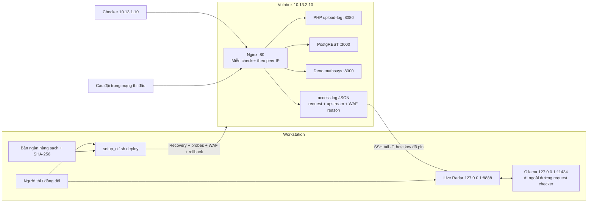

# Sổ tay ngân hàng CTF: recovery, defense và attack

## Graph dùng cho template



Các backend chỉ nên có đường truy cập đúng thiết kế. Nginx và backend khác container thì `127.0.0.1` không trỏ tới container khác: sinh profile với DNS của từng container. Không tự đổi firewall/bind trước khi kiểm tra tuyến checker thực tế.

## 1. Chuẩn bị một lần theo bài đã thực hành

1. Giữ bản source/config sạch và version runtime từ ngân hàng, **trước khi máy bị chiếm quyền**. Lưu offline trên workstation; không commit secrets, PCAP hoặc flag đang sống.
2. Ghi đúng IP checker, routing, site Nginx đang dùng, schema messages/chats và binary/đường source của mathsays. Điền `config.env`, `DEF/checker_probes.json`, `DEF/recovery_plan.json`.
3. Pin fingerprint SSH từ nguồn BTC. `StrictHostKeyChecking=yes` không tự chấp nhận host bị thay key. Không copy private key/token của workstation lên Vulnbox.
4. Chạy rehearsal khôi phục trên bản sao bài: checksum, owner/mode, restart đúng service, upload–download, POST–GET chat và kết quả mathsays phải khớp checker. File example chỉ là điểm bắt đầu; route PHP/schema và biểu thức mathsays cần điền đúng bài.

```bash
./set_target.sh 10.13.2.10 2201 ~/.ssh/cyberknight_id "80 8080 3000 8000" 2
./setup_ctf.sh prepare
./setup_ctf.sh verify

# Nếu Deno nhận path / thay vì /mathsays:
./setup_ctf.sh prepare --math-prefix strip

# Nếu Nginx trong Docker, thay bằng tên upstream đã kiểm chứng:
./setup_ctf.sh prepare --php php:8080 --api postgrest:3000 --maths mathsays:8000

# Nếu router gốc http://service còn điều phối cả ba service:
./setup_ctf.sh prepare --topology router --router service
```

Profile direct mặc định strip `/api/` khi chuyển tới PostgREST và preserve `/mathsays`. Nếu PostgREST/router của bài cần giữ `/api/`, dùng `--api-prefix preserve`. Đổi prefix phải rehearsal; IP miễn checker không sửa được routing sai.

Nginx include cần được load **một lần trong `http {}`**, thay đúng site có thật. Cần Nginx >= 1.17.6 với proxy, limit_req và realip module. Biến `$realip_remote_addr` dùng peer TCP gốc, kể cả khi `$remote_addr` đã được realip module đổi. Không chèn file vào một `server {}` khác, không bật thêm default server trùng `:80`.

## 2. WAF phải bảo toàn checker

`CHECKER_IPS` là danh sách IP nguồn mà Nginx trực tiếp quan sát, mặc định `10.13.1.10`. Khi sinh candidate, map này cho checker đi qua **mọi signature, method, route, query rule**. Rate-limit key của checker là chuỗi rỗng nên không bị tính hạn mức, kể cả bật enforcement. Không miễn chặn theo `X-Forwarded-For` hay User-Agent do người gửi kiểm soát.

Không cấu hình `real_ip_header`/`set_real_ip_from` để tin nguồn không đáng tin. Nếu checker qua NAT hoặc proxy của BTC, phải xác định peer IP đúng và phạm vi tin cậy trước khi chạy; không miễn toàn mạng thi đấu khi các đội dùng chung nguồn.

Mặc định:

| Lớp | Checker | Nguồn khác |
| --- | --- | --- |
| Storage `.ph*`, vendor, dotfiles | Pass | Chặn dấu hiệu tương ứng |
| GET/HEAD messages | Pass mọi query | Chỉ bộ lọc ID + select cột đã liệt kê |
| GET/HEAD chats | Pass mọi query | ID/name filter + select cột đã liệt kê |
| POST chats/messages | Pass | Query rỗng hoặc select cột đã liệt kê |
| Method API, view/table/RPC khác | Pass | Giới hạn route; RPC mặc định không expose qua edge |
| Mathsays | Pass | Signature substitution query, có xét mixed/double encoding |
| Rate limit | Không tính hạn mức | Dry-run; không chặn cho tới khi bật enforcement |

`client_max_body_size 0` tránh thêm giới hạn upload ở edge khi chưa biết contract checker. Giữ timeout proxy 90s. Quyền app, quota storage và tài nguyên OS vẫn cần cấu hình theo bài; không hạ limit chung dựa trên cảm tính. Không bật `sub_filter` đổi flag vì checker cần nhận nguyên dữ liệu.

Đây là mitigation, **không phải quyền đọc**: biết ID vẫn có thể đọc nếu DB cho phép. Chữ ký mathsays không xử lý body/header và không chứng minh hết command injection. Không gọi GET dữ liệu hợp lệ của PostgREST là SQL injection nếu chưa có bằng chứng.

## 3. Khi máy bị chiếm quyền hoặc mã hóa

```bash
# Workstation: chạy đúng plan đã rehearsal.
./setup_ctf.sh deploy \
  --target /etc/nginx/sites-enabled/service.conf \
  --probes DEF/checker_probes.json \
  --recover DEF/recovery_plan.json --clean-bundle ./clean-bank

# Dịch vụ đang hoạt động: bỏ phần --recover/--clean-bundle.
./setup_ctf.sh radar
```

Chuỗi chạy: triage hiện trạng → verify toàn bộ checksum → lưu file sắp thay → atomic restore → restart unit/container đã liệt kê → probe → baseline probe WAF → backup site → `nginx -t` → reload → probe → capture.

Nếu thấy tiến trình vẫn đang mã hóa, xác nhận PID/binary/parent/service liên quan rồi cô lập **đúng tiến trình đó** trước khi restore. Template không tự kill theo tên chung, đổi mật khẩu tất cả user, xóa keys/cron hoặc flush firewall. Các thao tác đó có thể làm mất SSH, job checker và service flags.

Recovery plan chỉ khôi phục file đã liệt kê và pin SHA-256. Không khôi phục toàn filesystem/DB bằng bản ngân hàng cũ khi đang có flag còn sống. Với DB đã bị mã hóa, dùng backup/restore theo bài đã thực hành và kiểm tra dữ liệu/tick; generic file restore không thay PostgreSQL backup hợp lệ.

Khi checksum nguồn sạch sai, script dừng trước khi thay file. Khi restart/probe thất bại, nó đưa file về trạng thái trước thao tác. **Trạng thái trước thao tác có thể vẫn bị hỏng**: rollback bảo toàn bằng chứng, không phải bảo đảm khôi phục. Active malware hoặc host/root đã bị chiếm có thể làm sai kết quả; cần đối chiếu từ workstation và giải pháp khôi phục của BTC.

## 4. Probe và rollback

Probe manifest thực thi request thực tế với status, nội dung và deadline; hỗ trợ lấy ID từ POST rồi dùng lại cho GET. Dùng marker giả `gd1-readiness-probe`, không flag thật. Các POST có thể để lại bản ghi test; dọn theo cách bài cho phép sau rehearsal.

```bash
# Vulnbox hoặc bản sao bài trong đúng network namespace:
python3 /root/DEF/check_contract.py \
  --manifest /root/DEF/checker_probes.json --base-url http://127.0.0.1

# Kiểm tra GET thật, không dùng curl -I (đó là HEAD):
curl --max-time 5 -sS -o /dev/null -w '%{http_code}\n' \
  'http://127.0.0.1/api/messages'

# Restore site từ đường backup script vừa in ra:
bash /root/DEF/deploy_waf.sh --target /etc/nginx/sites-enabled/service.conf \
  --restore /var/lib/gd1/waf-backups/<timestamp>.conf
```

Sau deploy, xác nhận checker chính thức qua ít nhất một tick: cắm–đọc đúng flag, upload–download đúng bytes, phép toán đúng nội dung và thời gian. Probe từ localhost kiểm tra routing và contract nhưng **không giả lập danh tính checker**. Regression offline kiểm tra map miễn checker; kiểm thử Nginx thực tế từ nguồn checker là bước rehearsal bổ sung.

Sao lưu site/full config ở `/var/lib/gd1/waf-backups/`, trạng thái sự cố ở `/var/lib/gd1/incident-*`, bản file trước recovery ở `/var/lib/gd1/recovery/`. Không `git reset --hard` trên live service để rollback. Đừng để backup trong webroot.

## 5. Vá sâu theo source ngân hàng

### PHP upload-log

- Lưu upload ngoài webroot, phục vụ bằng endpoint đọc dữ liệu; không `include` file do người dùng cung cấp.
- Server quyết định đường lưu và tên file; kiểm tra traversal, overwrite, symlink và quota. Giữ filename/format mà checker cần qua metadata nếu hợp đồng yêu cầu.
- Code/config không ghi được bởi UID phục vụ PHP. Storage không có handler PHP ở chính backend, kể cả truy cập trực tiếp :8080. `noexec` một mình không ngăn interpreter đọc file.
- Whitelist đúng extension của bài và kiểm tra nội dung phù hợp; không mặc định chỉ `.txt/.log` nếu checker dùng `.csv/.json/.out`.

### PostgREST / PostgreSQL

- Tách role API khỏi owner/superuser/BYPASSRLS; giới hạn exposed schema và quyền SELECT/INSERT/UPDATE/DELETE/EXECUTE đúng contract.
- Dùng RLS theo danh tính/capability đã xác thực, kiểm tra `USING` và `WITH CHECK`; rà soát views, functions SECURITY DEFINER và search_path.
- Kiểm tra embedding qua chats, write `return=representation`, upsert và RPC. Edge không thấy hết ngữ nghĩa PostgREST.
- Nếu checker và đối thủ đều anonymous, chỉ biết ID, regex ID không tạo được quyền riêng. Phải dựa vào cơ chế truy cập của bài và quyền DB, không đặt secret bất kỳ khiến checker không còn truy cập.

### Deno mathsays

- Bỏ ghép input vào `sh -c`. Gọi binary trực tiếp với argv/stdin; dùng `--` nếu CLI hỗ trợ hoặc dùng thư viện.
- Không xóa `$`, backtick, `;`, `*` hay ký tự toán học khỏi dữ liệu checker để chữa shell injection. Dữ liệu phải được giữ nguyên khi không đi qua shell.
- Nếu có eval biểu thức, thay bằng parser giới hạn phép toán. Giới hạn output, execution time và concurrency theo rehearsal.
- Thu hẹp quyền Deno/UID/mount/network; tránh `-A` và allow-run tùy ý. Đừng để một service đọc storage/flag/credentials của hai service còn lại nếu contract không cần.

Source PHP/Deno/SQL thật chưa có trong repo này; áp những thay đổi trên bản ngân hàng, thêm checksum của **bản đã vá và rehearsal** vào clean bundle. Template không tự thay source không nhìn thấy.

## 6. Radar, PCAP và attack khi dịch vụ đã ổn

Radar bind `127.0.0.1:8888`, Ollama dùng URL/model trong config. URI/nhãn được render bằng textContent, không innerHTML; CSP hạn chế script. Chỉ một yêu cầu AI chạy cùng lúc, payload tối đa 4096 ký tự, timeout cấu hình. Không có chức năng tự thực thi hoặc apply lời khuyên LLM.

Muốn chia sẻ Radar, ưu tiên SSH tunnel. Public bind cần `RADAR_TOKEN`, `RADAR_ALLOWED_HOSTS` và kênh mã hóa; HTTP Basic không mã hóa token. TEAM_IP_MAP dùng mapping BTC, không suy đoán team từ octet cuối. Khi chưa có mapping, UI ghi IP nguồn.

```bash
./pull_pcaps.sh
cd ATK
./one_click_atk.sh
```

Capture ring riêng, quyền 0700, mặc định khoảng 400 MB; sync chỉ công bố file sau khi kiểm tra metadata/size/magic và atomic rename. Không xóa source remote. Local giữ tối đa PCAP_LOCAL_FILES file do công cụ tạo; ring có thể mất lịch sử nếu chưa sync đủ nhanh. PCAP/log có thể chứa secrets/flag, chỉ dùng trong máy phân tích được bảo vệ.

Phản công theo mẫu đã rehearsal: xác nhận payload trên bản sao → ghi nhận service/đội/tick → khai thác trong phạm vi giải → nộp qua adapter đã xác minh. Chọn một submission owner, giữ cache accepted riêng theo trận, kiểm tra retry/429/timeout; không bật nhiều farm cùng nộp một cờ. Target builder đã xét cả IP/port theo đội và dừng khi trỏ về service đội nhà; parser verdict dùng pattern có anchor, không xem HTTP 200 lỗi là accepted. Menu ATK và payload mẫu chưa thay cho target/adapter của BTC. Standalone chưa có durable pending queue: muốn retry chắc chắn khi flag không còn được exploit trả lại, dùng farm đã rehearsal hoặc bổ sung queue theo protocol. Set-target chỉ đồng bộ danh tính/cổng đội nhà, giữ cấu hình adapter và địa chỉ đối thủ riêng trong ATK/config.env.

## 7. Kiểm chứng và nguồn kỹ thuật

```bash
./setup_ctf.sh verify
python3 preflight.py --profile def
bash -n push_def.sh DEF/deploy_waf.sh DEF/one_click_def.sh
```

Không có Nginx binary trong workspace hiện tại; regression offline không thay `nginx -t` và replay checker thật. `deploy_waf.sh` bắt buộc chạy syntax/probe tại Vulnbox và rollback khi thất bại.

Tài liệu chính thức: [Nginx location/normalization](https://nginx.org/en/docs/http/ngx_http_core_module.html#location), [proxy_pass và URI](https://nginx.org/en/docs/http/ngx_http_proxy_module.html#proxy_pass), [rate-limit key rỗng/dry-run](https://nginx.org/en/docs/http/ngx_http_limit_req_module.html), [PostgREST embedding](https://docs.postgrest.org/en/stable/references/api/resource_embedding.html), [PostgreSQL RLS](https://www.postgresql.org/docs/current/ddl-rowsecurity.html), [Deno permissions](https://docs.deno.com/runtime/reference/permissions/).
